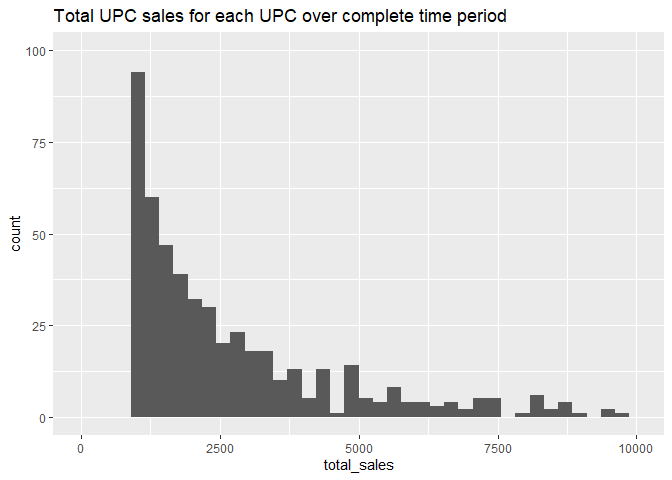

The purpose of this file is to document our decisions on how to define
an observation from the panel data to include in the model. This will be
a record of why we made the choices we did, as well as a road map for
the data prep.

    knitr::opts_chunk$set(echo = TRUE)
    library(dplyr)
    library(tidyverse)
    library(ggplot2)
    load("panel_data.RData")

Panel
=====

UPCs purchased for each panelist; row for each week-panelist-UPC-store
combination that had a purchase

    head(panel_data)

    ## # A tibble: 6 x 22
    ##   panel_id  year  week  store outlet upc   units dollars large_category
    ##      <dbl> <int> <dbl>  <dbl> <chr>  <chr> <dbl>   <dbl> <chr>         
    ## 1  1100016     1  1126 234140 GR     1490~     2    7.98 CATEGORY - CA~
    ## 2  1100016     1  1129 234140 GR     6149~     4   12.0  CATEGORY - CA~
    ## 3  1100016     1  1132 234140 GR     1490~     1    7.99 CATEGORY - CA~
    ## 4  1100016     1  1135 234140 GR     1490~     1    5.99 CATEGORY - CA~
    ## 5  1100016     1  1140 234140 GR     6149~     4   14.8  CATEGORY - CA~
    ## 6  1100016     1  1143 234140 GR     1490~     4   16.0  CATEGORY - CA~
    ## # ... with 13 more variables: small_category <chr>, parent_co <chr>,
    ## #   vendor <chr>, brand <chr>, upc_desc <chr>, vol_eq <dbl>,
    ## #   product_type <chr>, package <chr>, flavor <chr>, calorie <chr>,
    ## #   caffeine <chr>, sweetener_type <chr>, juice_percentage <chr>

How many panelists are in the panel data in total?

    length(unique(panel_data$panel_id))

    ## [1] 11699

How many UPCs are in the panel data in total?

    length(unique(panel_data$upc))

    ## [1] 3546

How many stores are in the panel data in total?

    length(unique(panel_data$store))

    ## [1] 102

What is an observation in the dynamic brand equity model?
---------------------------------------------------------

1.  Weekly decision: buy or not / quantity purchased / UPC(s) chosen
2.  Conditional on store visit: buy or not / quantity purchased
3.  Conditional on carbonated beverage purchase incidence in a week:
    quantity purchased / UPC(s) chosen
4.  Conditional on buying each unit: UPC chosen

Option 1:

    purch_occassion <- panel_data %>% group_by(panel_id, year) %>% summarise(n_purch=n())

    purch_occassion %>% filter(year==1) %>% ggplot(aes(x=n_purch)) + geom_histogram() + labs(x="number purchases per year", title="Number of purchases per year for year 1")

    ## `stat_bin()` using `bins = 30`. Pick better value with `binwidth`.

Option 2: would be challenging to implement because we don’t actually
observe store visits directly. We would have to process data from other
IRI categories to try to infer this and that would be very time
consuming. This rules out Option 2.

Option 3: to assess the need to separately model incidence and purchase
quantity, we compute the total number of units purchased in each week
(conditional on purchasing some beverages). The majority of panelists
buy less than 5 units per week.

    panel_week_units <- panel_data %>% group_by(panel_id, week) %>% summarise(n_units=sum(units))
    panel_week_units %>% ggplot(aes(x=n_units)) + geom_histogram(binwidth = 1) + xlim(0, 25) + labs(title="Number of units panelists buy in a week", y="count of panelist-weeks", x="number of units purchased in a week")

    ## Warning: Removed 1475 rows containing non-finite values (stat_bin).

    ## Warning: Removed 2 rows containing missing values (geom_bar).

Option 4: People seldom buy more than one UPC in a week, so when
customers buy more than one unit, it is usually multiple units of the
same UPC. This means it is unreasonable to assume that two units
purchased in the same week are independant making Option 4 less
desirable.

    panel_week_upc <- panel_data %>% group_by(panel_id, week) %>%
      summarise(n_upc_week=n_distinct(upc))
    panel_week_upc %>% ggplot(aes(x=n_upc_week)) + geom_histogram() + labs(x="number of UPCs in a week", y="count of panelist-weeks", title="Number of different UPCs customers buy in a week")

    ## `stat_bin()` using `bins = 30`. Pick better value with `binwidth`.

How many UPCs will be included in each choice set? Will we ignore purchases of UPCs with lower overall sales?
-------------------------------------------------------------------------------------------------------------

It would be dificult to model all 3500+ UPCs that are purchased in the
panel data. To find a reasonable cut-off, we looked at total sales
(across all time periods) for each UPC. There a a relatively small
number of high-selling UPCs.

    upc_total_sales <- panel_data %>% group_by(upc) %>% summarise(total_sales = sum(units)) %>% arrange(desc(total_sales))

    upc_total_sales %>% ggplot(aes(x=total_sales)) + geom_histogram(bins=40) + labs(title="Total UPC sales for each UPC over complete time period") + xlim(0, 10000) + ylim(0, 100)

    ## Warning: Removed 63 rows containing non-finite values (stat_bin).

    ## Warning: Removed 5 rows containing missing values (geom_bar).

If we use the top 100 UPCs, then we are eliminating nearly 36% of sales
in the panel data. If we use the top 200 UPCs, then we are eliminating
23% of sales in the panel data.

    total_sales <- panel_data %>% ungroup() %>% summarise(total_sales=sum(dollars))

    sales_100 <- panel_data %>% group_by(upc) %>% summarise(total_sales=sum(dollars)) %>% arrange(desc(total_sales)) %>% slice(1:100) %>% summarise(total_sales=sum(total_sales))
    sales_100*100/total_sales

    ##   total_sales
    ## 1    64.52112

    sales_200 <- panel_data %>% group_by(upc) %>% summarise(total_sales=sum(dollars)) %>% arrange(desc(total_sales)) %>% slice(1:200) %>% summarise(total_sales=sum(total_sales))
    sales_200*100/total_sales

    ##   total_sales
    ## 1    76.98661

A table of the top 100 UPCs over the period with their sales quantity
and features.

The joined table have more than 100 rows. The reason is that recorded
upc information changed over the years. For example, upc 14900002890 has
its type of sweetener recorded differently as “HGH FRCT CRN SYP SCR” and
“HGH FRCTS & CORN SYR” in different periods. Or upc 14900000551 has its
volume recorded differently as 0.3522 & 0.3521 in different periods.

    top100upc <- panel_data %>% group_by(upc) %>% summarise(total_sales=sum(dollars)) %>% arrange(desc(total_sales)) %>% slice(1:100) %>% left_join(panel_data, by="upc") %>% select(-total_sales, -panel_id,-year, -week,-store,-outlet, -units, -dollars, -large_category) %>% distinct()

    head(top100upc)

    ## # A tibble: 6 x 14
    ##   upc   small_category parent_co vendor brand upc_desc vol_eq product_type
    ##   <chr> <chr>          <chr>     <chr>  <chr> <chr>     <dbl> <chr>       
    ## 1 1490~ LOW CALORIE S~ COCA COL~ COCA ~ DIET~ +DCOKE ~   0.75 SODA        
    ## 2 1490~ LOW CALORIE S~ COCA COL~ COCA ~ DIET~ +DCOKE ~   0.75 SODA        
    ## 3 1490~ REGULAR SOFT ~ COCA COL~ COCA ~ COKE~ +COKCL ~   0.75 SODA        
    ## 4 1490~ REGULAR SOFT ~ COCA COL~ COCA ~ COKE~ +COKCL ~   0.75 SODA        
    ## 5 1490~ LOW CALORIE S~ COCA COL~ COCA ~ DIET~ +DCOKE ~   1.5  SODA        
    ## 6 1490~ LOW CALORIE S~ COCA COL~ COCA ~ DIET~ +DCOKE ~   1.5  SODA        
    ## # ... with 6 more variables: package <chr>, flavor <chr>, calorie <chr>,
    ## #   caffeine <chr>, sweetener_type <chr>, juice_percentage <chr>

    # The code below keeps only the last record and returns 100 rows only
    top100upc <- top100upc[!duplicated(top100upc$upc, fromLast=TRUE),]
    unique(top100upc$upc)

    ##   [1] "14900002891"  "14900002890"  "14900001063"  "11200080994"  "11200080995" 
    ##   [6] "14900001278"  "11200000017"  "21200000088"  "11200000053"  "11200080996" 
    ##  [11] "14900002934"  "14900000639"  "14900001252"  "11200080997"  "11200081003" 
    ##  [16] "14900002892"  "14900000914"  "11200000170"  "14900000663"  "14900001178" 
    ##  [21] "11200000113"  "614900000634" "51200000841"  "11200000016"  "17800008216" 
    ##  [26] "11200000524"  "17800008316"  "21200081014"  "14900002468"  "14900002469" 
    ##  [31] "14900000935"  "11200000496"  "14900000551"  "11200081000"  "14900001020" 
    ##  [36] "21200000826"  "24900002344"  "11200081013"  "24900003711"  "11200000230" 
    ##  [41] "11200000849"  "21200000902"  "14900000600"  "14900003105"  "11200000231" 
    ##  [46] "14900003637"  "11200081002"  "614900000658" "11200000568"  "14900000129" 
    ##  [51] "14900004255"  "17800008310"  "24900000045"  "11200081007"  "11200000190" 
    ##  [56] "11200000838"  "17800008210"  "11200000132"  "24900003012"  "17800015216" 
    ##  [61] "17800015246"  "14900003103"  "11200081017"  "21200000130"  "14900002933" 
    ##  [66] "14900000929"  "24900002341"  "14900003104"  "11200000233"  "11200000492" 
    ##  [71] "11200000839"  "11200081019"  "17800000034"  "14900002542"  "24900000044" 
    ##  [76] "11200000495"  "11200010028"  "614900000132" "25490003019"  "11200000569" 
    ##  [81] "14900003108"  "14900002345"  "17800001080"  "17800000075"  "17800005316" 
    ##  [86] "14900002470"  "17800001716"  "11200080999"  "17800005216"  "31200010130" 
    ##  [91] "31200000916"  "14900000927"  "11200000519"  "14900001464"  "14900000243" 
    ##  [96] "11200081005"  "17800020616"  "11200010041"  "17800001168"  "11200000225"

How will we compute the price for each UPC?
-------------------------------------------

1.  Average price at the store that the customer visited, with missing
    stores replaced with averages
2.  Average price paid in that week from the panel data

To assess how bad Option 2 will be relative to option 1, we looked at
the range of prices for a UPC within a given week (across stores) from
the panel data.

    top4 <- panel_data %>% group_by(upc) %>% summarise(total_sales=sum(dollars)) %>% arrange(desc(total_sales)) %>% slice(1:4)

    top4_data <- panel_data %>% ungroup() %>% filter(upc %in% c(top4$upc)) %>% mutate(avg_price=dollars/units) %>% group_by(upc, avg_price)

    top4_upc <- unique(top4$upc)

    #there are 451 weeks the top 4 upcs are all sold in 
    top4_data %>% group_by(week) %>% distinct(upc) %>% arrange(week) %>% group_by(week) %>% summarise(n=n()) %>% filter(n==4)

    ## # A tibble: 451 x 2
    ##     week     n
    ##    <dbl> <int>
    ##  1  1236     4
    ##  2  1237     4
    ##  3  1238     4
    ##  4  1239     4
    ##  5  1240     4
    ##  6  1241     4
    ##  7  1242     4
    ##  8  1243     4
    ##  9  1244     4
    ## 10  1245     4
    ## # ... with 441 more rows

    top4_data %>% filter(week==1590) %>% ggplot(aes(x=upc, y=avg_price)) + geom_violin()

Update the original data file using the upc information of the latest year in cases of information changes over the years
=========================================================================================================================

    # Extract upc list then drop duplicates, keeping information of the latest year
    upc_list <- panel_data[,-c(1:5,7:8)] 
    upc_list <- upc_list[!duplicated(upc_list$upc, fromLast=TRUE),]

    # Merge upc information back to data file
    panel_data <- panel_data[,1:8] %>% inner_join(upc_list,by = "upc")
      
    save(panel_data, file="panel_data.RData")
