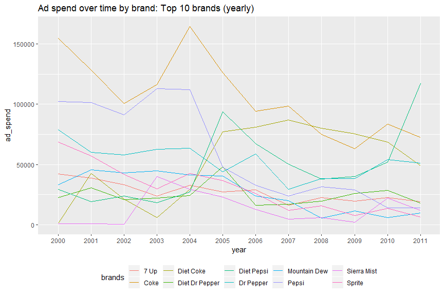
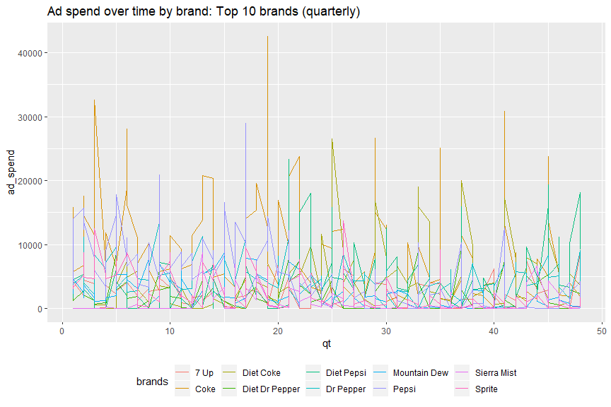
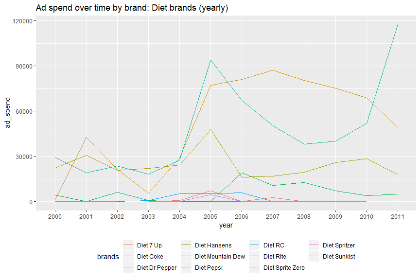
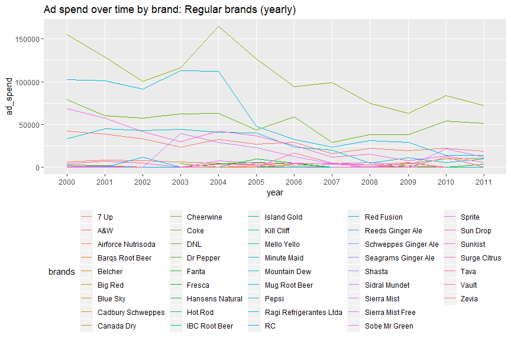
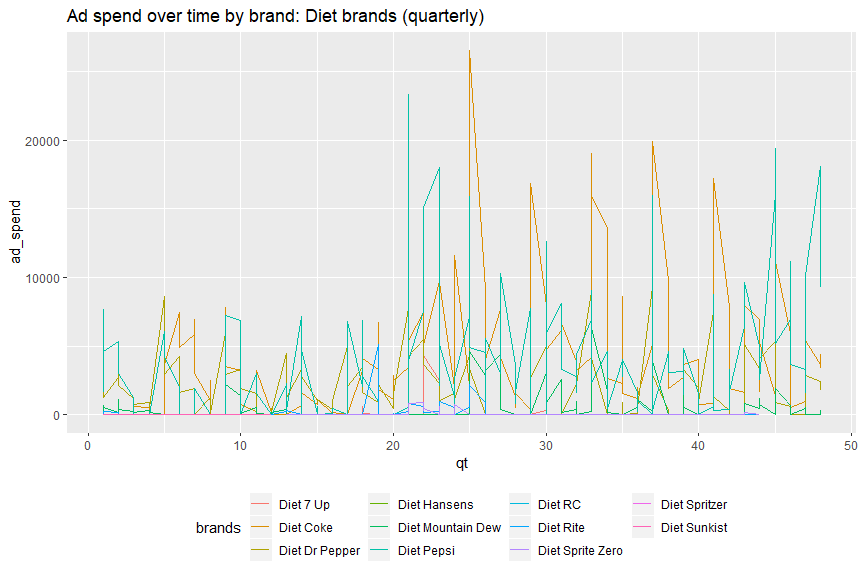
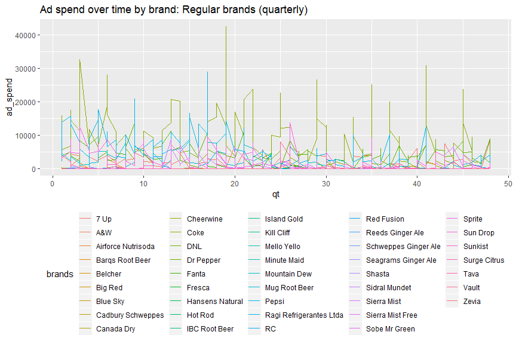

Load ad data and libraries.

    library(dplyr)
    library(tidyverse)
    library(lubridate)

    ad_99_02 <- read_csv("Carbonated_Soft_Drinks_929876_export.csv")
    ad_00_02 <- ad_99_02[-nrow(ad_99_02),-(2:13)] # Remove last row as GRAND TOTAL
    ad_03_06 <- read_csv("Carbonated_Soft_Drinks_929878_export.csv")
    ad_03_06 <- ad_03_06[-nrow(ad_03_06),]
    ad_07_10 <- read_csv("Carbonated_Soft_Drinks_929879_export.csv")
    ad_07_10 <- ad_07_10[-nrow(ad_07_10),]
    ad_11_14 <- read_csv("Carbonated_Soft_Drinks_929880_export.csv")
    ad_11    <- ad_11_14[-nrow(ad_11_14),1:13]
    rm(ad_99_02,ad_11_14)

Clean datasets.
===============

-   Reformat each dataset.
-   Merge all the datasets.
-   Split date into month & year.
-   Remove NA in ad\_spend column. No missing months in the data.
-   Create a `quarter` column.
-   Aggreate `ad_spend` per (brand,month,year,qt).

<!-- -->

    # Format each dataset
    ad_00_02 <- ad_00_02 %>% gather(key="date", value="ad_spend", -BRAND)
    ad_03_06 <- ad_03_06 %>% gather(key="date", value="ad_spend", -BRAND)
    ad_07_10 <- ad_07_10 %>% gather(key="date", value="ad_spend", -BRAND)
    ad_11    <- ad_11    %>% gather(key="date", value="ad_spend", -BRAND)

    # Merge datasets
    beverage_ad_spend <- ad_00_02 %>% bind_rows(ad_03_06) %>% bind_rows(ad_07_10) %>% bind_rows(ad_11)

    # Remove NAs
    beverage_ad_spend <- beverage_ad_spend %>% drop_na(ad_spend)

    # Split date into month & year
    beverage_ad_spend <- beverage_ad_spend %>% mutate(month_1=substr(date, 1, 3), year=substr(date, 5, 8)) %>% mutate(month=factor(month_1, levels=c("JAN", "FEB", "MAR", "APR", "MAY", "JUN", "JUL", "AUG", "SEP", "OCT", "NOV", "DEC"))) %>% select(-month_1)

    # Create a columns for `quarter`
    qtrs <- beverage_ad_spend %>% distinct(year, month) %>% arrange(year, month) %>% mutate(qt=rep(1:48, each=3))

    beverage_ad_spend <- beverage_ad_spend %>% left_join(qtrs, by=c("year", "month")) %>% dplyr::select(-date)

    # Brands in the table
    unique(beverage_ad_spend$BRAND)

    ##   [1] "7 Up"                            "A&W"                            
    ##   [3] "A&W Root Beer"                   "Barqs Root Beer"                
    ##   [5] "Belcher"                         "Blue Sky"                       
    ##   [7] "Canada Dry"                      "Canada Dry Ginger Ale"          
    ##   [9] "Coca-Cola"                       "Coca-Cola Citra"                
    ##  [11] "Diet Coke"                       "Diet Coke Caffeine Free"        
    ##  [13] "Diet Coke With Lemon"            "Diet Dr Pepper"                 
    ##  [15] "Diet Mountain Dew"               "Diet Pepsi"                     
    ##  [17] "Diet RC"                         "Diet Rite Caffeine Free"        
    ##  [19] "Diet Rite No Sodium Cola"        "Diet Spritzer"                  
    ##  [21] "Diet Sunkist"                    "Dr Pepper"                      
    ##  [23] "Hansens Natural"                 "Hot Rod"                        
    ##  [25] "IBC Root Beer"                   "Mello Yello"                    
    ##  [27] "Minute Maid"                     "Mountain Dew"                   
    ##  [29] "Mountain Dew Code Red"           "Mountain Dew Sponsorship"       
    ##  [31] "Mug Root Beer"                   "Pepsi"                          
    ##  [33] "Pepsi Blue"                      "Pepsi One"                      
    ##  [35] "Pepsi Twist"                     "Pepsi Wild Cherry"              
    ##  [37] "RC"                              "RC Edge"                        
    ##  [39] "Red Fusion"                      "Schweppes Ginger Ale"           
    ##  [41] "Shasta Cranberry"                "Shasta St Nicks"                
    ##  [43] "Sierra Mist"                     "Sobe Mr Green"                  
    ##  [45] "Sprite"                          "Sprite Sponsorship"             
    ##  [47] "Sunkist"                         "Surge Citrus"                   
    ##  [49] "Vanilla Coke"                    "7 Up Plus"                      
    ##  [51] "Big Red"                         "Black Cherry Vanilla Coke"      
    ##  [53] "Cadbury Schweppes"               "Cheerwine"                      
    ##  [55] "Coca-Cola Blak"                  "Coca-Cola C2"                   
    ##  [57] "Coca-Cola Light"                 "Coca-Cola With Lime"            
    ##  [59] "Coca-Cola Zero"                  "Diet 7 Up"                      
    ##  [61] "Diet Cherry Vanilla Dr Pepper"   "Diet Coke With Lime"            
    ##  [63] "Diet Hansens"                    "Diet Pepsi Caffeine Free"       
    ##  [65] "Diet Pepsi Jazz"                 "Diet Pepsi Vanilla"             
    ##  [67] "Diet Rite"                       "Diet Rite Pure Zero"            
    ##  [69] "Diet Sprite Zero"                "DNL"                            
    ##  [71] "Dr Pepper Berries & Cream"       "Fanta"                          
    ##  [73] "Fresca"                          "Island Gold"                    
    ##  [75] "Mountain Dew Live Wire"          "Mountain Dew MDX Energy Soda"   
    ##  [77] "Pepsi Edge"                      "Pepsi Holiday Spice"            
    ##  [79] "Pepsi Lime"                      "Pepsi Vanilla"                  
    ##  [81] "Ragi Refrigerantes Ltda"         "Sierra Mist Cranberry Splash"   
    ##  [83] "Sierra Mist Free"                "Sprite Remix Berryclear"        
    ##  [85] "Sprite Remix Sponsorship"        "Sprite Tropical Remix"          
    ##  [87] "Vault"                           "Airforce Nutrisoda"             
    ##  [89] "Cherry 7 Up"                     "Cherry Coke"                    
    ##  [91] "Coca-Cola Zero Sponsorship"      "Coke Light"                     
    ##  [93] "Diet Coke Plus"                  "Diet Dr Pepper Cherry Chocolate"
    ##  [95] "Dr Pepper Cherry"                "Dr Pepper Corporate"            
    ##  [97] "Dr Pepper Sponsorship"           "Mountain Dew Game Fuel"         
    ##  [99] "Mountain Dew Voltage"            "Mountain Dew White Out"         
    ## [101] "Pepsi Lemon"                     "Pepsi Max"                      
    ## [103] "Pepsi Throwback"                 "Sidral Mundet"                  
    ## [105] "Sierra Mist Lemon Squeeze"       "Sierra Mist Natural"            
    ## [107] "Sierra Mist Ruby Splash"         "Sierra Mist Undercover Orange"  
    ## [109] "Sunkist Solar Fusion"            "Tava"                           
    ## [111] "7 Up Sponsorship"                "7 Up Ten"                       
    ## [113] "Diet Mountain Dew Voltage"       "Dr Pepper 10"                   
    ## [115] "Kill Cliff"                      "Mountain Dew Baja Blast"        
    ## [117] "Mountain Dew Kick Start"         "Mountain Dew Supernova"         
    ## [119] "Pepsi Next"                      "Pepsi X"                        
    ## [121] "Reeds Ginger Ale"                "Seagrams Ginger Ale"            
    ## [123] "Sprite 6Mix"                     "Sun Drop"                       
    ## [125] "Zevia"

    # Create a column of higher brand level
    sevenup <- c("7 Up","7 Up Plus","Cherry 7 Up","7 Up Sponsorship","7 Up Ten")
    aw <- c("A&W Root Beer","A&W")
    canadadry <- c("Canada Dry Ginger Ale","Canada Dry")
    coke <- c("Cherry Coke","Coca-Cola","Coca-Cola Citra","Vanilla Coke","Black Cherry Vanilla Coke","Coca-Cola Blak","Coca-Cola C2","Coca-Cola With Lime")
    dietcoke <- c("Diet Coke","Diet Coke Caffeine Free","Diet Coke With Lemon","Coca-Cola Light","Coca-Cola Zero","Diet Coke With Lime","Coca-Cola Zero Sponsorship","Coke Light","Diet Coke Plus")
    dietdrpepper <- c("Diet Dr Pepper","Diet Cherry Vanilla Dr Pepper","Diet Dr Pepper Cherry Chocolate")
    dietmdew <- c("Diet Mountain Dew","Diet Mountain Dew Voltage")
    dietpepsi <- c("Diet Pepsi","Pepsi One","Diet Pepsi Caffeine Free","Diet Pepsi Jazz","Diet Pepsi Vanilla","Pepsi Max")
    dietrite <- c("Diet Rite","Diet Rite Caffeine Free","Diet Rite No Sodium Cola","Diet Rite Pure Zero")
    drpepper <- c("Dr Pepper","Dr Pepper Berries & Cream","Dr Pepper Cherry","Dr Pepper Corporate","Dr Pepper Sponsorship","Dr Pepper 10")
    mdew <- c("Mountain Dew","Mountain Dew Sponsorship","Mountain Dew Code Red","Mountain Dew Live Wire","Mountain Dew MDX Energy Soda","Mountain Dew Game Fuel","Mountain Dew Voltage","Mountain Dew White Out","Mountain Dew Supernova","Mountain Dew Kick Start","Mountain Dew Baja Blast")
    rc <- c("RC","RC Edge")
    pepsi <- c("Pepsi","Pepsi Blue","Pepsi Twist","Pepsi Wild Cherry","Pepsi Edge","Pepsi Holiday Spice","Pepsi Lime","Pepsi Vanilla","Pepsi Lemon","Pepsi Throwback","Pepsi Next","Pepsi X")
    shasta <- c("Shasta St Nicks","Shasta Cranberry")
    sierra <- c("Sierra Mist","Sierra Mist Cranberry Splash","Sierra Mist Lemon Squeeze","Sierra Mist Natural","Sierra Mist Ruby Splash","Sierra Mist Undercover Orange")
    sprite <- c("Sprite","Sprite Sponsorship","Sprite Remix Berryclear","Sprite Remix Sponsorship","Sprite Tropical Remix","Sprite 6Mix")
    sunkist <- c("Sunkist","Sunkist Solar Fusion")

    beverage_ad_spend <- beverage_ad_spend %>% mutate(brands=ifelse(BRAND %in% sevenup,"7 Up",ifelse(BRAND %in% aw,"A&W",ifelse(BRAND %in% canadadry,"Canada Dry",ifelse(BRAND %in% coke,"Coke",ifelse(BRAND %in% dietcoke,"Diet Coke",ifelse(BRAND %in% dietdrpepper,"Diet Dr Pepper",ifelse(BRAND %in% dietmdew,"Diet Mountain Dew",ifelse(BRAND %in% dietpepsi,"Diet Pepsi",ifelse(BRAND %in% dietrite,"Diet Rite",ifelse(BRAND %in% drpepper,"Dr Pepper",ifelse(BRAND %in% mdew,"Mountain Dew",ifelse(BRAND %in% rc,"RC",ifelse(BRAND %in% pepsi,"Pepsi",ifelse(BRAND %in% shasta,"Shasta",ifelse(BRAND %in% sierra,"Sierra Mist",ifelse(BRAND %in% sprite,"Sprite",ifelse(BRAND %in% sunkist,"Sunkist",BRAND)))))))))))))))))) %>% select(brands,month,year,qt,ad_spend)
      
    table(is.na(beverage_ad_spend$brands)) # All values are converted.

    ## 
    ## FALSE 
    ##  7932

    unique(beverage_ad_spend$brands) # Re-check all brands

    ##  [1] "7 Up"                    "A&W"                    
    ##  [3] "Barqs Root Beer"         "Belcher"                
    ##  [5] "Blue Sky"                "Canada Dry"             
    ##  [7] "Coke"                    "Diet Coke"              
    ##  [9] "Diet Dr Pepper"          "Diet Mountain Dew"      
    ## [11] "Diet Pepsi"              "Diet RC"                
    ## [13] "Diet Rite"               "Diet Spritzer"          
    ## [15] "Diet Sunkist"            "Dr Pepper"              
    ## [17] "Hansens Natural"         "Hot Rod"                
    ## [19] "IBC Root Beer"           "Mello Yello"            
    ## [21] "Minute Maid"             "Mountain Dew"           
    ## [23] "Mug Root Beer"           "Pepsi"                  
    ## [25] "RC"                      "Red Fusion"             
    ## [27] "Schweppes Ginger Ale"    "Shasta"                 
    ## [29] "Sierra Mist"             "Sobe Mr Green"          
    ## [31] "Sprite"                  "Sunkist"                
    ## [33] "Surge Citrus"            "Big Red"                
    ## [35] "Cadbury Schweppes"       "Cheerwine"              
    ## [37] "Diet 7 Up"               "Diet Hansens"           
    ## [39] "Diet Sprite Zero"        "DNL"                    
    ## [41] "Fanta"                   "Fresca"                 
    ## [43] "Island Gold"             "Ragi Refrigerantes Ltda"
    ## [45] "Sierra Mist Free"        "Vault"                  
    ## [47] "Airforce Nutrisoda"      "Sidral Mundet"          
    ## [49] "Tava"                    "Kill Cliff"             
    ## [51] "Reeds Ginger Ale"        "Seagrams Ginger Ale"    
    ## [53] "Sun Drop"                "Zevia"

    # Aggregate ad_spend per (brand,year,month)
    beverage_ad_spend <- beverage_ad_spend %>% group_by(brands,month,year,qt) %>% summarise(ad_spend=sum(ad_spend))

Here is what the data looks like:

    head(beverage_ad_spend)

    ## # A tibble: 6 x 5
    ## # Groups:   brands, month, year [6]
    ##   brands month year     qt ad_spend
    ##   <chr>  <fct> <chr> <int>    <dbl>
    ## 1 7 Up   JAN   2000      1    5021.
    ## 2 7 Up   JAN   2001      5    2305.
    ## 3 7 Up   JAN   2002      9    3045.
    ## 4 7 Up   JAN   2003     13    2018.
    ## 5 7 Up   JAN   2004     17    2086.
    ## 6 7 Up   JAN   2005     21    5051.

Plots of `ad_spend` over time
=============================

    # Top 10 brands yearly
    top10brands <- beverage_ad_spend %>% group_by(brands) %>% summarise(ad_spend=sum(ad_spend)) %>% arrange(desc(ad_spend)) %>% slice(1:10)
    top10brands

    ## # A tibble: 10 x 2
    ##    brands         ad_spend
    ##    <chr>             <dbl>
    ##  1 Coke           1278361.
    ##  2 Pepsi           712753.
    ##  3 Dr Pepper       636533.
    ##  4 Diet Coke       618547 
    ##  5 Diet Pepsi      576018 
    ##  6 Sprite          357342.
    ##  7 7 Up            326405.
    ##  8 Mountain Dew    324169.
    ##  9 Diet Dr Pepper  292198.
    ## 10 Sierra Mist     152547.

    top10data <- beverage_ad_spend %>% filter(brands %in% top10brands$brands)
    top10data %>% group_by(brands, year) %>% summarise(ad_spend=sum(ad_spend)) %>% ggplot(aes(x=year, y=ad_spend, col=brands)) + geom_line(aes(group=brands)) + ggtitle("Ad spend over time by brand: Top 10 brands (yearly)") + theme(legend.position="bottom")

    # Top 10 brands quarterly
    top10data %>% ggplot(aes(x=qt, y=ad_spend, col=brands)) + geom_line(aes(group=brands)) + ggtitle("Ad spend over time by brand: Top 10 brands (quarterly)") + theme(legend.position="bottom")

    # Regular vs Diet brands
    diet <- c("Diet 7 Up","Diet Coke","Diet Dr Pepper","Diet Hansens","Diet Mountain Dew","Diet Pepsi","Diet RC","Diet Rite","Diet Sprite Zero","Diet Spritzer","Diet Sunkist")
    dietdata <- beverage_ad_spend %>% filter(brands %in% diet)
    regulardata <- beverage_ad_spend %>% filter(!brands %in% diet)

    ## Yearly
    dietdata %>% group_by(brands, year) %>% summarise(ad_spend=sum(ad_spend)) %>% ggplot(aes(x=year, y=ad_spend, col=brands)) + geom_line(aes(group=brands)) + ggtitle("Ad spend over time by brand: Diet brands (yearly)") + theme(legend.position="bottom")

    regulardata %>% group_by(brands, year) %>% summarise(ad_spend=sum(ad_spend)) %>% ggplot(aes(x=year, y=ad_spend, col=brands)) + geom_line(aes(group=brands)) + ggtitle("Ad spend over time by brand: Regular brands (yearly)") + theme(legend.position="bottom")

    ## Quarterly
    dietdata %>% ggplot(aes(x=qt, y=ad_spend, col=brands)) + geom_line(aes(group=brands)) + ggtitle("Ad spend over time by brand: Diet brands (quarterly)") + theme(legend.position="bottom")

    regulardata %>% ggplot(aes(x=qt, y=ad_spend, col=brands)) + geom_line(aes(group=brands)) + ggtitle("Ad spend over time by brand: Regular brands (quarterly)") + theme(legend.position="bottom")

Stats for 1st year pres

    top10data %>% ungroup() %>% filter(brands=="Coke",year=="2000") %>% summarise(mean_spend=mean(ad_spend))

    ## # A tibble: 1 x 1
    ##   mean_spend
    ##        <dbl>
    ## 1     12897.

    top10data %>% ungroup() %>% filter(brands=="Coke",year=="2000") %>% summarise(sd_spend=sd(ad_spend))

    ## # A tibble: 1 x 1
    ##   sd_spend
    ##      <dbl>
    ## 1    7305.

    top10data %>% ungroup() %>% filter(brands=="Diet Coke",year=="2000") %>% summarise(mean_spend=mean(ad_spend))

    ## # A tibble: 1 x 1
    ##   mean_spend
    ##        <dbl>
    ## 1       95.8

    top10data %>% ungroup() %>% filter(brands=="Diet Coke",year=="2000") %>% summarise(sd_spend=sd(ad_spend))

    ## # A tibble: 1 x 1
    ##   sd_spend
    ##      <dbl>
    ## 1     224.
