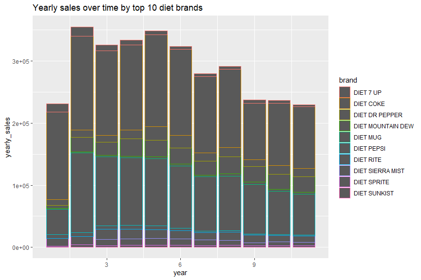
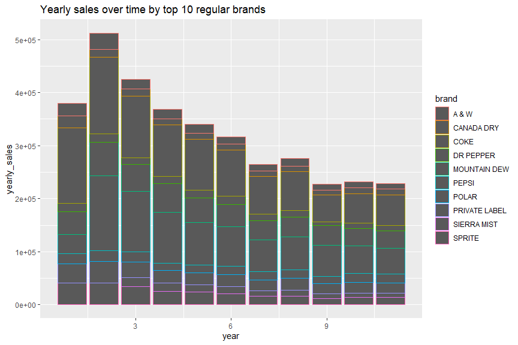

Load libraries and data set. The `panel_data` data set was created by
merging household panel data with the tissue UPC characteristics.

    library(dplyr)
    library(tidyverse)

    load("panel_data.RData")

Clean data
==========

Filter out unused brand information

    unused_brands <- c("ALL AMERICAN","ALL BRAND","ALL COKE PRODUCTS","ALL PEPSI PRODUCTS")
    panel_data <- panel_data %>% filter(!brand %in% unused_brands)

Split dataset for `diet` and `regular` brands

    # Brands in the table
    sort(unique(panel_data$brand))

    ##   [1] "7 UP"                          "7 UP PLUS"                    
    ##   [3] "7 UP POMEGRANATE"              "7 UP RETRO"                   
    ##   [5] "A & W"                         "ADIRONDACK"                   
    ##   [7] "ADIRONDACK CLEAR N NATURAL"    "ADIRONDACK NATURALS"          
    ##   [9] "AIRFORCE NUTRISODA"            "AMERICAS ORIGINAL BREWERY 191"
    ##  [11] "ARIZONA RX VITAMIN SODA"       "BARQS"                        
    ##  [13] "BARRILITOS"                    "BARRITTS"                     
    ##  [15] "BAUMEISTER"                    "BAWLS"                        
    ##  [17] "BERGHOFF"                      "BIG PEACH"                    
    ##  [19] "BIG PINEAPPLE"                 "BIG RED"                      
    ##  [21] "BLACK BEAR"                    "BLACK CHERRY VANILLA COKE"    
    ##  [23] "BLUE SKY"                      "BLUMERS"                      
    ##  [25] "BOYLANS"                       "BRIARS"                       
    ##  [27] "BUBBLING CAULDRON"             "BUDDYS"                       
    ##  [29] "CAFFEINE FREE COKE CLASSIC"    "CAFFEINE FREE DIET COKE"      
    ##  [31] "CAFFEINE FREE DIET DR PEPPER"  "CAFFEINE FREE DIET PEPSI"     
    ##  [33] "CAFFEINE FREE PEPSI"           "CANADA DRY"                   
    ##  [35] "CANFIELD"                      "CANFIELD 50 50"               
    ##  [37] "CAPE COD"                      "CAPE COD DRY"                 
    ##  [39] "CHERRY 7 UP"                   "CHERRY COKE"                  
    ##  [41] "CHERRY R C"                    "CHERRY VANILLA DR PEPPER"     
    ##  [43] "CHUBBY"                        "CITRA"                        
    ##  [45] "CITRUS BLAST"                  "COCA COLA"                    
    ##  [47] "COKE"                          "COKE BLAK"                    
    ##  [49] "COKE C2"                       "COKE CHERRY ZERO"             
    ##  [51] "COKE CLASSIC"                  "COKE VANILLA ZERO"            
    ##  [53] "COKE WITH LIME"                "COKE ZERO"                    
    ##  [55] "COOL MOUNTAIN"                 "COTTON CLUB"                  
    ##  [57] "CRUSH"                         "DADS"                         
    ##  [59] "DIET 7 UP"                     "DIET BARQS"                   
    ##  [61] "DIET BLACK CHERRY VANILLA COK" "DIET CHERRY 7 UP"             
    ##  [63] "DIET CHERRY CHOCOLATE DR PEPP" "DIET CHERRY COKE"             
    ##  [65] "DIET CHERRY VANILLA DR PEPPER" "DIET CITRUS BLAST"            
    ##  [67] "DIET COKE"                     "DIET COKE PLUS"               
    ##  [69] "DIET COKE WITH LEMON"          "DIET COKE WITH LIME"          
    ##  [71] "DIET COKE WITH SPLENDA"        "DIET DR PEPPER"               
    ##  [73] "DIET GRANDPA GRAFS"            "DIET HANSENS"                 
    ##  [75] "DIET MELLO YELLO"              "DIET MINUTE MAID"             
    ##  [77] "DIET MOUNTAIN DEW"             "DIET MOUNTAIN DEW CAFFEINE FR"
    ##  [79] "DIET MOUNTAIN DEW CODE RED"    "DIET MOUNTAIN DEW ULTRA VIOLE"
    ##  [81] "DIET MTN DEW SUPERNOVA"        "DIET MTN DEW VOLTAGE"         
    ##  [83] "DIET MUG"                      "DIET PEPSI"                   
    ##  [85] "DIET PEPSI JAZZ"               "DIET PEPSI NFL KICKOFF"       
    ##  [87] "DIET PEPSI TWIST"              "DIET PEPSI VANILLA"           
    ##  [89] "DIET PEPSI WITH LIME"          "DIET R C"                     
    ##  [91] "DIET RITE"                     "DIET RITE PURE ZERO"          
    ##  [93] "DIET SCHWEPPES"                "DIET SIERRA MIST"             
    ##  [95] "DIET SIERRA MIST CRANBERRY SP" "DIET SIERRA MIST FREE"        
    ##  [97] "DIET SIERRA MIST RUBY SPLASH"  "DIET SLICE"                   
    ##  [99] "DIET SPRITE"                   "DIET SQUIRT"                  
    ## [101] "DIET STEAZ"                    "DIET SUN DROP"                
    ## [103] "DIET SUNKIST"                  "DIET TROPICANA TWISTER"       
    ## [105] "DIET VANILLA COKE"             "DIET VERNORS"                 
    ## [107] "DIET WILD CHERRY PEPSI"        "DNL"                          
    ## [109] "DOG N SUDS"                    "DR BROWN"                     
    ## [111] "DR MCGILLICUDDYS"              "DR PEPPER"                    
    ## [113] "DR PEPPER HERITAGE"            "DR PEPPER RED FUSION"         
    ## [115] "DR PEPPER TEN"                 "FANTA"                        
    ## [117] "FANTA ZERO ORANGE"             "FAYGO"                        
    ## [119] "FAYGO MOON MIST"               "FAYGO OHANA"                  
    ## [121] "FLATHEAD LAKE GOURMET SODA"    "FLATHEAD LAKE MONSTER"        
    ## [123] "FRESCA"                        "FROSTOP"                      
    ## [125] "GINSENG UP"                    "GOOSE ISLAND ORANGE CREAM"    
    ## [127] "GOOSE ISLAND ROOT BEER"        "GOSLINGS"                     
    ## [129] "GOYA"                          "GOYA LIGHT"                   
    ## [131] "GOYA MALTA"                    "GRAFS"                        
    ## [133] "GRAFS 50 50"                   "GRANDPA GRAFS"                
    ## [135] "GRAPENSTEIN"                   "GRAYS"                        
    ## [137] "GROWN UP SODA"                 "HALLOWEEN"                    
    ## [139] "HANKS"                         "HANSENS"                      
    ## [141] "HANSENS SIGNATURE"             "HEALTH VALLEY"                
    ## [143] "HIRES"                         "IBC"                          
    ## [145] "IRON HORSE"                    "JARRITOS"                     
    ## [147] "JEFFS"                         "JELLY BELLY"                  
    ## [149] "JOLLY GOOD"                    "JOLLY RANCHER"                
    ## [151] "JOLT"                          "JOLT BLUE"                    
    ## [153] "JOLT RED"                      "JOLT ULTRA"                   
    ## [155] "JONES"                         "JONES ZILCH"                  
    ## [157] "JOURNEY"                       "LOTSA POP"                    
    ## [159] "MELLO YELLO"                   "MELLO YELLO MELON"            
    ## [161] "MELLO YELLO THE ORIGINAL SMOO" "MELLO YELLO ZERO"             
    ## [163] "MEXICAN COCA COLA"             "MINUTE MAID"                  
    ## [165] "MOUNTAIN DEW"                  "MOUNTAIN DEW CAFFEINE FREE"   
    ## [167] "MOUNTAIN DEW CODE RED"         "MOUNTAIN DEW DISTORTION"      
    ## [169] "MOUNTAIN DEW GAME FUEL"        "MOUNTAIN DEW MDX"             
    ## [171] "MOUNTAIN DEW MDX SUGAR FREE"   "MOUNTAIN DEW PITCH BLACK"     
    ## [173] "MOUNTAIN DEW PITCH BLACK 2"    "MOUNTAIN DEW REVOLUTION"      
    ## [175] "MOUNTAIN DEW SUPERNOVA"        "MOUNTAIN DEW THROWBACK"       
    ## [177] "MOUNTAIN DEW TYPHOON"          "MOUNTAIN DEW VOLTAGE"         
    ## [179] "MOUNTAIN DEW WHITE OUT"        "MOXIE"                        
    ## [181] "MR PIBB"                       "MR PIBB ZERO"                 
    ## [183] "MR Q CUMBER"                   "MT DEW LIVE WIRE"             
    ## [185] "MUG"                           "NASH BROTHERS"                
    ## [187] "NATURAL BREW"                  "OLD TOWNE"                    
    ## [189] "OLDE BROOKLYN"                 "PEPPER FREE"                  
    ## [191] "PEPSI"                         "PEPSI BLUE"                   
    ## [193] "PEPSI EDGE"                    "PEPSI HOLIDAY SPICE"          
    ## [195] "PEPSI MAX"                     "PEPSI MAX CEASE FIRE"         
    ## [197] "PEPSI NFL KICKOFF"             "PEPSI ONE"                    
    ## [199] "PEPSI SUMMER MIX"              "PEPSI THROWBACK"              
    ## [201] "PEPSI TWIST"                   "PEPSI VANILLA"                
    ## [203] "PEPSI WITH LIME"               "PEPSI XL"                     
    ## [205] "PIBB XTRA"                     "PJ'S CRYSTAL BEACH"           
    ## [207] "POINT PREMIUM"                 "POLAR"                        
    ## [209] "PRIVATE LABEL"                 "Q TONIC"                      
    ## [211] "R C"                           "RED BULL"                     
    ## [213] "REEDS"                         "REGATTA"                      
    ## [215] "RUBY RED SQUIRT"               "SCHWEPPES"                    
    ## [217] "SEAGRAMS"                      "SENORIAL"                     
    ## [219] "SHASTA"                        "SHASTA SHORTZ"                
    ## [221] "SHIRAKIKU"                     "SIDRAL MUNDET"                
    ## [223] "SIERRA MIST"                   "SIERRA MIST CRANBERRY SPLASH" 
    ## [225] "SIERRA MIST FREE"              "SIERRA MIST FREE UNDERCOVR OR"
    ## [227] "SIERRA MIST NATURAL"           "SIERRA MIST RUBY SPLASH"      
    ## [229] "SIERRA MIST SQUEEZE"           "SIERRA MIST UNDERCOVER ORANGE"
    ## [231] "SILVER BAY"                    "SILVER SPRING"                
    ## [233] "SIOUX CITY"                    "SLICE"                        
    ## [235] "SNOW"                          "SOHO NATURAL"                 
    ## [237] "SOUTHERN SWIRL"                "SPRECHER"                     
    ## [239] "SPRITE"                        "SPRITE REMIX"                 
    ## [241] "SPRITE REMIX ARUBA JAM"        "SPRITE TROPICAL REMIX"        
    ## [243] "SPRITE ZERO"                   "SQUEEZE"                      
    ## [245] "SQUIRT"                        "STEAP"                        
    ## [247] "STEAZ"                         "STEWARTS"                     
    ## [249] "STEWARTS FOUNTAIN CLASSICS"    "SUN DROP"                     
    ## [251] "SUNKIST"                       "SUNKIST CITRUS FUSION"        
    ## [253] "SUNKIST SOLAR FUSION"          "SURGE"                        
    ## [255] "TAB"                           "TAHITIAN TREAT"               
    ## [257] "TAVA BRAZILIAN SAMBA"          "TAVA MEDITERRANEAN FIESTA"    
    ## [259] "TAVA TAHITIAN TAMURE"          "TOMMY KNOCKER"                
    ## [261] "TOPO CHICO"                    "TROPICANA TWISTER"            
    ## [263] "VANILLA COKE"                  "VANILLA COKE ZERO"            
    ## [265] "VAULT"                         "VAULT RED BLITZ"              
    ## [267] "VAULT ZERO"                    "VERNORS"                      
    ## [269] "VESS"                          "VINTAGE"                      
    ## [271] "VIRGILS"                       "WAIST WATCHER"                
    ## [273] "WELCHS"                        "WHITE ROCK"                   
    ## [275] "WILD CHERRY PEPSI"             "WILD OATS"                    
    ## [277] "WILDWEST"                      "WILDWOOD"                     
    ## [279] "ZEVIA"

    # Create a column of higher brand level
    sevenup <- c("7 UP","7 UP PLUS","7 UP POMEGRANATE","7 UP RETRO","CHERRY 7 UP")
    adirondack <- c("ADIRONDACK","ADIRONDACK CLEAR N NATURAL","ADIRONDACK NATURALS")
    bigred <- c("BIG RED","BIG PINEAPPLE","BIG PEACH")
    canfield <- c("CANFIELD","CANFIELD 50 50")
    cape <- c("CAPE COD","CAPE COD DRY")
    coke <- c("COKE","BLACK CHERRY VANILLA COKE","COCA COLA","CAFFEINE FREE COKE CLASSIC","CHERRY COKE","COKE BLAK","COKE C2","COKE CLASSIC","COKE WITH LIME","MEXICAN COCA COLA","VANILLA COKE")
    diet7up <- c("DIET 7 UP","DIET CHERRY 7 UP")
    dietcoke <- c("DIET COKE","CAFFEINE FREE DIET COKE","COKE VANILLA ZERO","COKE CHERRY ZERO","COKE ZERO","DIET BLACK CHERRY VANILLA COK","DIET CHERRY COKE","DIET COKE WITH LIME","DIET COKE PLUS","DIET COKE WITH SPLENDA","DIET COKE WITH LEMON","DIET VANILLA COKE","VANILLA COKE ZERO")
    dietdrpepper <- c("DIET DR PEPPER","CAFFEINE FREE DIET DR PEPPER","DIET CHERRY VANILLA DR PEPPER","DIET CHERRY CHOCOLATE DR PEPP","PEPPER FREE")
    dietmdew <- c("DIET MOUNTAIN DEW","DIET MOUNTAIN DEW CAFFEINE FR","DIET MOUNTAIN DEW ULTRA VIOLE","DIET MOUNTAIN DEW CODE RED","DIET MTN DEW SUPERNOVA","DIET MTN DEW VOLTAGE","MOUNTAIN DEW MDX SUGAR FREE")
    dietpepsi <- c("DIET PEPSI","CAFFEINE FREE DIET PEPSI","DIET PEPSI JAZZ","DIET PEPSI TWIST","DIET PEPSI NFL KICKOFF","DIET PEPSI WITH LIME","DIET PEPSI VANILLA","DIET WILD CHERRY PEPSI","PEPSI MAX","PEPSI MAX CEASE FIRE","PEPSI ONE")
    dietrite <- c("DIET RITE","DIET RITE PURE ZERO")
    dietsierra <- c("DIET SIERRA MIST","DIET SIERRA MIST CRANBERRY SP","DIET SIERRA MIST FREE","DIET SIERRA MIST RUBY SPLASH","SIERRA MIST FREE","SIERRA MIST FREE UNDERCOVR OR")
    dietsprite <- c("DIET SPRITE","SPRITE ZERO")
    drpepper <- c("DR PEPPER","CHERRY VANILLA DR PEPPER","DR PEPPER HERITAGE","DR PEPPER TEN","DR PEPPER RED FUSION")
    faygo <- c("FAYGO","FAYGO MOON MIST","FAYGO OHANA")
    flathead <- c("FLATHEAD LAKE GOURMET SODA","FLATHEAD LAKE MONSTER")
    goose <- c("GOOSE ISLAND ORANGE CREAM","GOOSE ISLAND ROOT BEER")
    goya <- c("GOYA","GOYA LIGHT","GOYA MALTA")
    grafs <- c("GRAFS","GRAFS 50 50","GRANDPA GRAFS")
    hansens <- c("HANSENS","HANSENS SIGNATURE")
    jolt <- c("JOLT","JOLT BLUE","JOLT RED","JOLT ULTRA")
    mello <- c("MELLO YELLO","MELLO YELLO MELON","MELLO YELLO THE ORIGINAL SMOO")
    mdew <- c("MOUNTAIN DEW","MOUNTAIN DEW CAFFEINE FREE","MOUNTAIN DEW DISTORTION","MOUNTAIN DEW CODE RED","MOUNTAIN DEW GAME FUEL","MOUNTAIN DEW MDX","MOUNTAIN DEW PITCH BLACK","MOUNTAIN DEW PITCH BLACK 2","MOUNTAIN DEW REVOLUTION","MOUNTAIN DEW THROWBACK","MOUNTAIN DEW SUPERNOVA","MOUNTAIN DEW TYPHOON","MOUNTAIN DEW WHITE OUT","MOUNTAIN DEW VOLTAGE","MT DEW LIVE WIRE")
    pepsi <- c("PEPSI","CAFFEINE FREE PEPSI","PEPSI BLUE","PEPSI HOLIDAY SPICE","PEPSI EDGE","PEPSI NFL KICKOFF","PEPSI SUMMER MIX","PEPSI THROWBACK","PEPSI VANILLA","PEPSI TWIST","PEPSI WITH LIME","PEPSI XL","WILD CHERRY PEPSI")
    rc <- c("R C","CHERRY R C")
    shasta <- c("SHASTA","SHASTA SHORTZ")
    sierra <- c("SIERRA MIST","SIERRA MIST CRANBERRY SPLASH","SIERRA MIST NATURAL","SIERRA MIST SQUEEZE","SIERRA MIST RUBY SPLASH","SIERRA MIST UNDERCOVER ORANGE")
    sprite <- c("SPRITE","SPRITE REMIX","SPRITE TROPICAL REMIX","SPRITE REMIX ARUBA JAM")
    stewarts <- c("STEWARTS","STEWARTS FOUNTAIN CLASSICS")
    sunkist <- c("SUNKIST","SUNKIST CITRUS FUSION","SUNKIST SOLAR FUSION")
    tava <- c("TAVA BRAZILIAN SAMBA","TAVA MEDITERRANEAN FIESTA","TAVA TAHITIAN TAMURE")
    vault <- c("VAULT","VAULT RED BLITZ")

    panel_data <- panel_data %>% mutate(brand=ifelse(brand %in% sevenup,"7 UP",ifelse(brand %in% adirondack,"ADIRONDACK",ifelse(brand %in% bigred,"BIG RED",ifelse(brand %in% canfield,"CANFIELD",ifelse(brand %in% cape,"CAPE COD",ifelse(brand %in% coke,"COKE",ifelse(brand %in% diet7up,"DIET 7 UP",ifelse(brand %in% dietcoke,"DIET COKE",ifelse(brand %in% dietdrpepper,"DIET DR PEPPER",ifelse(brand %in% dietmdew,"DIET MOUNTAIN DEW",ifelse(brand %in% dietpepsi,"DIET PEPSI",ifelse(brand %in% dietrite,"DIET RITE",ifelse(brand %in% dietsierra,"DIET SIERRA MIST",ifelse(brand %in% dietsprite,"DIET SPRITE",ifelse(brand %in% drpepper,"DR PEPPER",ifelse(brand %in% faygo,"FAYGO",ifelse(brand %in% flathead,"FLATHEAD LAKE",ifelse(brand %in% goose,"GOOSE ISLAND",ifelse(brand %in% goya,"GOYA",ifelse(brand %in% grafs,"GRAFS",ifelse(brand %in% hansens,"HANSENS",ifelse(brand %in% jolt,"JOLT",ifelse(brand %in% mello,"MELLO YELLO",ifelse(brand %in% mdew,"MOUNTAIN DEW",ifelse(brand %in% pepsi,"PEPSI",ifelse(brand %in% rc,"RC",ifelse(brand %in% shasta,"SHASTA",ifelse(brand %in% sierra,"SIERRA MIST",ifelse(brand %in% sprite,"SPRITE",ifelse(brand %in% stewarts,"STEWARTS",ifelse(brand %in% sunkist,"SUNKIST",ifelse(brand %in% tava,"TAVA",ifelse(brand %in% vault,"VAULT",brand))))))))))))))))))))))))))))))))))

    table(is.na(panel_data$brand)) # All values are converted.

    ## 
    ##   FALSE 
    ## 2020983

    sort(unique(panel_data$brand)) # Re-check all brands

    ##   [1] "7 UP"                          "A & W"                        
    ##   [3] "ADIRONDACK"                    "AIRFORCE NUTRISODA"           
    ##   [5] "AMERICAS ORIGINAL BREWERY 191" "ARIZONA RX VITAMIN SODA"      
    ##   [7] "BARQS"                         "BARRILITOS"                   
    ##   [9] "BARRITTS"                      "BAUMEISTER"                   
    ##  [11] "BAWLS"                         "BERGHOFF"                     
    ##  [13] "BIG RED"                       "BLACK BEAR"                   
    ##  [15] "BLUE SKY"                      "BLUMERS"                      
    ##  [17] "BOYLANS"                       "BRIARS"                       
    ##  [19] "BUBBLING CAULDRON"             "BUDDYS"                       
    ##  [21] "CANADA DRY"                    "CANFIELD"                     
    ##  [23] "CAPE COD"                      "CHUBBY"                       
    ##  [25] "CITRA"                         "CITRUS BLAST"                 
    ##  [27] "COKE"                          "COOL MOUNTAIN"                
    ##  [29] "COTTON CLUB"                   "CRUSH"                        
    ##  [31] "DADS"                          "DIET 7 UP"                    
    ##  [33] "DIET BARQS"                    "DIET CITRUS BLAST"            
    ##  [35] "DIET COKE"                     "DIET DR PEPPER"               
    ##  [37] "DIET GRANDPA GRAFS"            "DIET HANSENS"                 
    ##  [39] "DIET MELLO YELLO"              "DIET MINUTE MAID"             
    ##  [41] "DIET MOUNTAIN DEW"             "DIET MUG"                     
    ##  [43] "DIET PEPSI"                    "DIET R C"                     
    ##  [45] "DIET RITE"                     "DIET SCHWEPPES"               
    ##  [47] "DIET SIERRA MIST"              "DIET SLICE"                   
    ##  [49] "DIET SPRITE"                   "DIET SQUIRT"                  
    ##  [51] "DIET STEAZ"                    "DIET SUN DROP"                
    ##  [53] "DIET SUNKIST"                  "DIET TROPICANA TWISTER"       
    ##  [55] "DIET VERNORS"                  "DNL"                          
    ##  [57] "DOG N SUDS"                    "DR BROWN"                     
    ##  [59] "DR MCGILLICUDDYS"              "DR PEPPER"                    
    ##  [61] "FANTA"                         "FANTA ZERO ORANGE"            
    ##  [63] "FAYGO"                         "FLATHEAD LAKE"                
    ##  [65] "FRESCA"                        "FROSTOP"                      
    ##  [67] "GINSENG UP"                    "GOOSE ISLAND"                 
    ##  [69] "GOSLINGS"                      "GOYA"                         
    ##  [71] "GRAFS"                         "GRAPENSTEIN"                  
    ##  [73] "GRAYS"                         "GROWN UP SODA"                
    ##  [75] "HALLOWEEN"                     "HANKS"                        
    ##  [77] "HANSENS"                       "HEALTH VALLEY"                
    ##  [79] "HIRES"                         "IBC"                          
    ##  [81] "IRON HORSE"                    "JARRITOS"                     
    ##  [83] "JEFFS"                         "JELLY BELLY"                  
    ##  [85] "JOLLY GOOD"                    "JOLLY RANCHER"                
    ##  [87] "JOLT"                          "JONES"                        
    ##  [89] "JONES ZILCH"                   "JOURNEY"                      
    ##  [91] "LOTSA POP"                     "MELLO YELLO"                  
    ##  [93] "MELLO YELLO ZERO"              "MINUTE MAID"                  
    ##  [95] "MOUNTAIN DEW"                  "MOXIE"                        
    ##  [97] "MR PIBB"                       "MR PIBB ZERO"                 
    ##  [99] "MR Q CUMBER"                   "MUG"                          
    ## [101] "NASH BROTHERS"                 "NATURAL BREW"                 
    ## [103] "OLD TOWNE"                     "OLDE BROOKLYN"                
    ## [105] "PEPSI"                         "PIBB XTRA"                    
    ## [107] "PJ'S CRYSTAL BEACH"            "POINT PREMIUM"                
    ## [109] "POLAR"                         "PRIVATE LABEL"                
    ## [111] "Q TONIC"                       "RC"                           
    ## [113] "RED BULL"                      "REEDS"                        
    ## [115] "REGATTA"                       "RUBY RED SQUIRT"              
    ## [117] "SCHWEPPES"                     "SEAGRAMS"                     
    ## [119] "SENORIAL"                      "SHASTA"                       
    ## [121] "SHIRAKIKU"                     "SIDRAL MUNDET"                
    ## [123] "SIERRA MIST"                   "SILVER BAY"                   
    ## [125] "SILVER SPRING"                 "SIOUX CITY"                   
    ## [127] "SLICE"                         "SNOW"                         
    ## [129] "SOHO NATURAL"                  "SOUTHERN SWIRL"               
    ## [131] "SPRECHER"                      "SPRITE"                       
    ## [133] "SQUEEZE"                       "SQUIRT"                       
    ## [135] "STEAP"                         "STEAZ"                        
    ## [137] "STEWARTS"                      "SUN DROP"                     
    ## [139] "SUNKIST"                       "SURGE"                        
    ## [141] "TAB"                           "TAHITIAN TREAT"               
    ## [143] "TAVA"                          "TOMMY KNOCKER"                
    ## [145] "TOPO CHICO"                    "TROPICANA TWISTER"            
    ## [147] "VAULT"                         "VAULT ZERO"                   
    ## [149] "VERNORS"                       "VESS"                         
    ## [151] "VINTAGE"                       "VIRGILS"                      
    ## [153] "WAIST WATCHER"                 "WELCHS"                       
    ## [155] "WHITE ROCK"                    "WILD OATS"                    
    ## [157] "WILDWEST"                      "WILDWOOD"                     
    ## [159] "ZEVIA"

    # Create separate dataset for diet & regular brands
    dietbrands <- c("AIRFORCE NUTRISODA","DIET 7 UP","DIET BARQS","DIET CITRUS BLAST","DIET COKE","DIET DR PEPPER","DIET GRANDPA GRAFS","DIET HANSENS","DIET MELLO YELLO","DIET MINUTE MAID","DIET MOUNTAIN DEW","DIET MUG","DIET PEPSI","DIET R C","DIET RITE","DIET SCHWEPPES","DIET SIERRA MIST","DIET SLICE","DIET SPRITE","DIET SQUIRT","DIET STEAZ","DIET SUN DROP","DIET SUNKIST","DIET TROPICANA TWISTER","DIET VERNORS","FANTA ZERO ORANGE","JONES ZILCH","MELLO YELLO ZERO","MR PIBB ZERO","VAULT ZERO")

    panel_data_diet <- panel_data %>% filter(brand %in% dietbrands)
    panel_data_regular <- setdiff(panel_data,panel_data_diet)

DIET DATA
=========

Find top 10 brands in terms of sales and plot sales.

    top10diet <- panel_data_diet %>% group_by(brand) %>% summarise(total_sales=sum(dollars)) %>% arrange(desc(total_sales)) %>% slice(1:10)

    top10diet_data <- panel_data %>% filter(brand %in% top10diet$brand) %>% group_by(brand,year) %>% summarise(yearly_sales=sum(dollars))

    top10diet_data %>% ggplot(aes(x=year, y=yearly_sales, col=brand)) + geom_bar(position="stack", stat="identity") + ggtitle("Yearly sales over time by top 10 diet brands") + theme(legend.position="right")

REGULAR DATA
============

Find top 10 brands in terms of sales and plot sales.

    top10regular <- panel_data_regular %>% group_by(brand) %>% summarise(total_sales=sum(dollars)) %>% arrange(desc(total_sales)) %>% slice(1:10)

    top10regular_data <- panel_data %>% filter(brand %in% top10regular$brand) %>% group_by(brand,year) %>% summarise(yearly_sales=sum(dollars))

    top10regular_data %>% ggplot(aes(x=year, y=yearly_sales, col=brand)) + geom_bar(position="stack", stat="identity") + ggtitle("Yearly sales over time by top 10 regular brands") + theme(legend.position="right")

