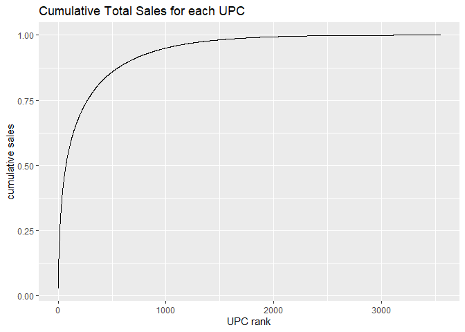
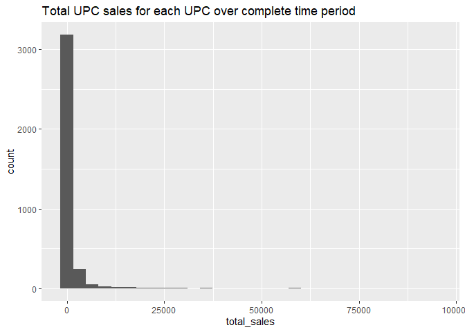
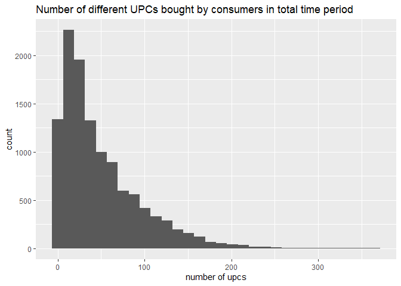
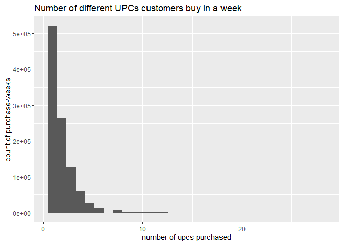
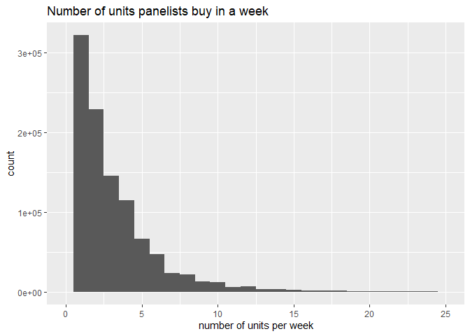
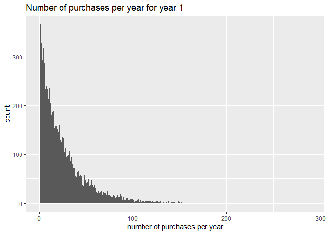
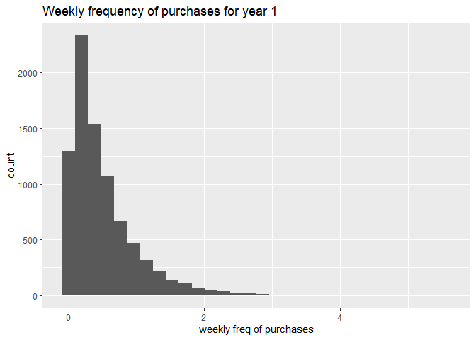

The purpose of this file is to describe the data according to Elea and
Eric’s question, so they do not have to search through the whole
`data_cleaning` file, instead they receive the knitted version of this
file from Morgan. To download and clean the data, please see the
`data_cleaning` markdown. This markdown will proceed as though the
`data_cleaning` file has been ran and the data is uploaded.

    library(dplyr)

    library(tidyverse)

    library(ggplot2)

    load("panel_data.RData")
    load("carbbev_upc.RData")

1. What does a row in each of the data files look like?
=======================================================

The `panel_data` file contains the panel data - the household purchase
data with upc characteristics. `panel_id` is the household id. `year` &
`week` indicate the time when the purchase was made. `store` refers to
the store key. `outlet` is the place where the purchase is made,
including grocery store (GR), drug store (DR), and mass merchandizer
(MA). `units` are the total number of units the household bought in the
given year, week, and store, `dollars` is the total amount spent.`upc`
is the upc. 
Other columns are upc characteristics, including
sub-categories (`small_category`), company (`parent_co`), vendor
(`vendor`), brand (`brand`), description of upc (`upc_desc`),
equivalized volume (`vol_eq`), product type (`product_type`), package
(`package`), flavor/scent (`flavor`), calorie level (`calorie`),
caffeine information (`caffeine`), type of sweetener (`sweetener_type`),
percentage of juice (`juice_percentage`).

    head(panel_data)

    ## # A tibble: 6 x 22
    ##   panel_id  year  week  store outlet upc   units dollars large_category
    ##      <dbl> <int> <dbl>  <dbl> <chr>  <chr> <dbl>   <dbl> <chr>         
    ## 1  1100016     1  1126 234140 GR     1490~     2    7.98 CATEGORY - CA~
    ## 2  1100016     1  1129 234140 GR     6149~     4   12.0  CATEGORY - CA~
    ## 3  1100016     1  1132 234140 GR     1490~     1    7.99 CATEGORY - CA~
    ## 4  1100016     1  1135 234140 GR     1490~     1    5.99 CATEGORY - CA~
    ## 5  1100016     1  1140 234140 GR     6149~     4   14.8  CATEGORY - CA~
    ## 6  1100016     1  1143 234140 GR     1490~     4   16.0  CATEGORY - CA~
    ## # ... with 13 more variables: small_category <chr>, parent_co <chr>,
    ## #   vendor <chr>, brand <chr>, upc_desc <chr>, vol_eq <dbl>,
    ## #   product_type <chr>, package <chr>, flavor <chr>, calorie <chr>,
    ## #   caffeine <chr>, sweetener_type <chr>, juice_percentage <chr>

2) What characteristics do we have about the UPCs? What are the different values each characteristic can take? (For ex, if size is a characteristic, what are all the possible sizes in the data?)
==================================================================================================================================================================================================

There are 13 UPC characteristics in the table as mentioned above, of
which `upc_desc` is the combination of other characteristics, including
brand, package, calorie level, caffeine information, and volume. The
number of different values per characteristic is as belows: 
- Small categories: There are 6 sub-categories, of which half of the purchases
are for regular soft drinks. 
- Company: 84. Coca Cola and Pepsico are the most popular. 
- Vendor: 91. Coca Cola and Pepsico are the most popular. 
- Brand: 287. Coke, Pepsi, and their diet brands are the most popular. 
- Equivalized volumes: 70. 0.75 & 0.3521 are the most common volumes. 
- Product types: 7. 94% of the purchases are soda. 
- Packages: 33. Some common packages: normal-resistance plastic bottle, can in
fridge pack box, can in box, plastic bottle, can, etc. 
- Flavor: 254. Most common flavors/scents: cola, lemon lime, root beer, etc. 
- Calorie level: 11. Regular accounts for over half of the purchases. Diet and No
calories are the second most common levels. 
- Caffeine information: 9. 50% of the purchases have caffeine, and 37% are caffeine free. 
- Type of sweetener: 37. Several common types: nutrasweet, high fructose corn
syrup, aspartame, etc. 
- Percentage of juice: 18. Over half has no percent given.

    panel_data %>% group_by(small_category) %>% filter(!small_category %in% c("MISSING", NA)) %>% summarise(count = n()) %>% arrange(desc(count))

    ## # A tibble: 6 x 2
    ##   small_category                     count
    ##   <chr>                              <int>
    ## 1 REGULAR SOFT DRINKS              1062656
    ## 2 LOW CALORIE SOFT DRINKS           838233
    ## 3 SELTZER/TONIC WATER/CLUB SODA     118098
    ## 4 SUGAR/CALORIE REDUCED SOFT DRINK    2184
    ## 5 PLU SOFT DRINKS                      417
    ## 6 PLU - ALL BRANDS SODA                114

    panel_data %>% group_by(parent_co) %>% filter(!parent_co %in% c("MISSING", NA)) %>% summarise(count = n()) %>% arrange(desc(count))

    ## # A tibble: 84 x 2
    ##    parent_co                 count
    ##    <chr>                     <int>
    ##  1 COCA COLA CO             686023
    ##  2 PEPSICO INC              635406
    ##  3 CADBURY SCHWEPPES P.L.C. 240529
    ##  4 PRIVATE LABEL            153556
    ##  5 ADIRONDACK BEVERAGE CO    91544
    ##  6 DR PEPPER/SNAPPLE GROUP   87666
    ##  7 POLAR CORP                86978
    ##  8 KRIER FOODS INC           17476
    ##  9 COTT BEVERAGES LTD.        5375
    ## 10 NATIONAL BEVERAGES CORP    4878
    ## # ... with 74 more rows

    panel_data %>% group_by(vendor) %>% filter(!vendor %in% c("MISSING", NA)) %>% summarise(count = n()) %>% arrange(desc(count))

    ## # A tibble: 91 x 2
    ##    vendor                   count
    ##    <chr>                    <int>
    ##  1 COCA COLA CO            682203
    ##  2 PEPSICO INC             631696
    ##  3 DR PEPPER/SEVEN-UP CORP 211382
    ##  4 PRIVATE LABEL           153556
    ##  5 ADIRONDACK BEVERAGE CO   91544
    ##  6 DR PEPPER/SNAPPLE GROUP  87666
    ##  7 POLAR CORP               86978
    ##  8 DR PEPPER/SEVEN-UP INC   23654
    ##  9 KRIER FOODS INC          17476
    ## 10 AMERICAN BOTTLING CO.     5493
    ## # ... with 81 more rows

    panel_data %>% group_by(brand) %>% filter(!brand %in% c("MISSING", NA)) %>% summarise(count = n()) %>% arrange(desc(count))

    ## # A tibble: 287 x 2
    ##    brand                    count
    ##    <chr>                    <int>
    ##  1 COKE CLASSIC            180644
    ##  2 DIET COKE               157248
    ##  3 PRIVATE LABEL           153556
    ##  4 PEPSI                   136307
    ##  5 DIET PEPSI              110967
    ##  6 MOUNTAIN DEW             80352
    ##  7 POLAR                    78865
    ##  8 SPRITE                   75579
    ##  9 CAFFEINE FREE DIET COKE  72132
    ## 10 A & W                    61049
    ## # ... with 277 more rows

    panel_data %>% group_by(vol_eq) %>% filter(!vol_eq %in% c("MISSING", NA)) %>% summarise(count = n()) %>% arrange(desc(count))

    ## # A tibble: 70 x 2
    ##    vol_eq  count
    ##     <dbl>  <int>
    ##  1 0.75   752685
    ##  2 0.352  575096
    ##  3 1.5    180902
    ##  4 0.104  132256
    ##  5 0.176   99332
    ##  6 0.375   71097
    ##  7 0.528   65747
    ##  8 0.5     38617
    ##  9 0.352   32837
    ## 10 0.0625  26030
    ## # ... with 60 more rows

    panel_data %>% group_by(product_type) %>% filter(!product_type %in% c("MISSING", NA)) %>% summarise(count = n()) %>% arrange(desc(count))

    ## # A tibble: 7 x 2
    ##   product_type      count
    ##   <chr>             <int>
    ## 1 SODA            1903603
    ## 2 SELTZER WATER     81135
    ## 3 TONIC WATER       28686
    ## 4 CLUB SODA          8271
    ## 5 SPARKLING WATER       5
    ## 6 BITTER LEMON          1
    ## 7 DRINK MIX             1

    panel_data %>% group_by(package) %>% filter(!package %in% c("MISSING", NA)) %>% summarise(count = n()) %>% arrange(desc(count))

    ## # A tibble: 33 x 2
    ##    package               count
    ##    <chr>                 <int>
    ##  1 NR PLASTIC BOTTLE    741193
    ##  2 CAN IN FRIDGE PCK BX 470185
    ##  3 CAN IN BOX           303007
    ##  4 PLASTIC BOTTLE       246706
    ##  5 CAN                  176866
    ##  6 CAN IN CUBE BOX       35231
    ##  7 RETURNABLE PL BOTTLE  10270
    ##  8 NON RETURNABLE GB     10223
    ##  9 NON RETURNABLE BTL     7883
    ## 10 GLASS BOTTLE           4822
    ## # ... with 23 more rows

    panel_data %>% group_by(flavor) %>% filter(!flavor %in% c("MISSING", NA)) %>% summarise(count = n()) %>% arrange(desc(count))

    ## # A tibble: 254 x 2
    ##    flavor       count
    ##    <chr>        <int>
    ##  1 COLA        818321
    ##  2 LEMON LIME  226824
    ##  3 ROOT BEER   141661
    ##  4 GINGER ALE   99592
    ##  5 DEW          81360
    ##  6 ORANGE       77762
    ##  7 PEPPER       61560
    ##  8 CITRUS DEW   47225
    ##  9 NATURAL      30839
    ## 10 CHERRY COLA  27867
    ## # ... with 244 more rows

    panel_data %>% group_by(calorie) %>% filter(!calorie %in% c("MISSING", NA)) %>% summarise(count = n()) %>% arrange(desc(count))

    ## # A tibble: 11 x 2
    ##    calorie           count
    ##    <chr>             <int>
    ##  1 REGULAR         1073481
    ##  2 DIET             847596
    ##  3 NO CALORIES       55990
    ##  4 CALORIE FREE      20395
    ##  5 ZERO CALORIES      3463
    ##  6 MID-CALORIE        2275
    ##  7 LOW CALORIE        1218
    ##  8 REGULAR OR DIET     531
    ##  9 100 CALORIES        271
    ## 10 FEWER CALORIES        3
    ## 11 5 CALORIES            1

    panel_data %>% group_by(caffeine) %>% filter(!caffeine %in% c("MISSING", NA)) %>% summarise(count = n()) %>% arrange(desc(count))

    ## # A tibble: 9 x 2
    ##   caffeine               count
    ##   <chr>                  <int>
    ## 1 CAFFEINE             1022089
    ## 2 CAFFEINE FREE         737535
    ## 3 NO CAFFEINE            97447
    ## 4 CAFFEINE FR/CAFFEINE     809
    ## 5 99% CAFFEINE FREE        245
    ## 6 99.9% CAFFEINE FREE      160
    ## 7 DOUBLE CAFFEINE           32
    ## 8 DECAFFEINATED             17
    ## 9 55% CAFFEINE FREE          5

    panel_data %>% group_by(sweetener_type) %>% filter(!sweetener_type %in% c("MISSING", NA)) %>% summarise(count = n()) %>% arrange(desc(count))

    ## # A tibble: 37 x 2
    ##    sweetener_type        count
    ##    <chr>                 <int>
    ##  1 NUTRA SWEET          346034
    ##  2 HGH FRCTS & CORN SYR 342504
    ##  3 SGR &// HG FRCS CR S 326771
    ##  4 ASPARTAME            282647
    ##  5 HGH FRCT CRN SYP SCR 195069
    ##  6 SWEETENED             87576
    ##  7 SUGAR FREE            84982
    ##  8 SPLENDA               31234
    ##  9 UNSWEETENED           19974
    ## 10 SUGAR                 14750
    ## # ... with 27 more rows

    panel_data %>% group_by(juice_percentage) %>% filter(!juice_percentage %in% c("MISSING", NA)) %>% summarise(count = n()) %>% arrange(desc(count))

    ## # A tibble: 18 x 2
    ##    juice_percentage       count
    ##    <chr>                  <int>
    ##  1 NO PERCENT GIVEN     1096164
    ##  2 CONTAINS NO FRUIT JC  156616
    ##  3 WITH JUICE            117207
    ##  4 0 PERCENT              28391
    ##  5 10 PERCENT              4754
    ##  6 LESS THAN 1% JUICE      4352
    ##  7 1 PERCENT               4085
    ##  8 2 PERCENT               2905
    ##  9 5 PERCENT               1813
    ## 10 LESS THAN 1 PERCENT     1751
    ## 11 NO JUICE                 682
    ## 12 6 PERCENT                442
    ## 13 3 PERCENT                287
    ## 14 15 PERCENT               145
    ## 15 8 PERCENT                 28
    ## 16 LESS THAN 2 PRCNT JC      24
    ## 17 IMPORTED                  12
    ## 18 25 PERCENT                 6

3/ What percentage of each characteristics are NA/Missing?
==========================================================

Flavor has 1.33% of the observations with missing values, calorie level
0.82%, caffeine information 8.08%, type of sweetener 12.07%, and
percentage of juice 29.78%. The remaining characteristics have no
missing values.

    missing <- data_frame() 

    ## Warning: `data_frame()` is deprecated, use `tibble()`.
    ## This warning is displayed once per session.

    small_category <- panel_data %>% ungroup() %>% select(small_category) %>% filter(small_category %in% c("MISSING", NA)) %>% summarise(n_obs=n())
    missing <- missing %>% bind_rows(small_category)

    parent_co <- panel_data %>% ungroup() %>% select(parent_co) %>% filter(parent_co %in% c("MISSING", NA)) %>% summarise(n_obs=n())
    missing <- missing %>% bind_rows(parent_co)

    vendor <- panel_data %>% ungroup() %>% select(vendor) %>% filter(vendor %in% c("MISSING", NA)) %>% summarise(n_obs=n())
    missing <- missing %>% bind_rows(vendor)

    brand <- panel_data %>% ungroup() %>% select(brand) %>% filter(brand %in% c("MISSING", NA)) %>% summarise(n_obs=n())
    missing <- missing %>% bind_rows(brand)

    vol_eq <- panel_data %>% ungroup() %>% select(vol_eq) %>% filter(vol_eq %in% c("MISSING", NA)) %>% summarise(n_obs=n())
    missing <- missing %>% bind_rows(vol_eq)

    product_type <- panel_data %>% ungroup() %>% select(product_type) %>% filter(product_type %in% c("MISSING", NA)) %>% summarise(n_obs=n())
    missing <- missing %>% bind_rows(product_type)

    package <- panel_data %>% ungroup() %>% select(package) %>% filter(package %in% c("MISSING", NA)) %>% summarise(n_obs=n())
    missing <- missing %>% bind_rows(package)

    flavor <- panel_data %>% ungroup() %>% select(flavor) %>% filter(flavor %in% c("MISSING", NA)) %>% summarise(n_obs=n())
    missing <- missing %>% bind_rows(flavor)

    calorie <- panel_data %>% ungroup() %>% select(calorie) %>% filter(calorie %in% c("MISSING", NA)) %>% summarise(n_obs=n())
    missing <- missing %>% bind_rows(calorie)

    caffeine <- panel_data %>% ungroup() %>% select(caffeine) %>% filter(caffeine %in% c("MISSING", NA)) %>% summarise(n_obs=n())
    missing <- missing %>% bind_rows(caffeine)

    sweetener_type <- panel_data %>% ungroup() %>% select(sweetener_type) %>% filter(sweetener_type %in% c("MISSING", NA)) %>% summarise(n_obs=n())
    missing <- missing %>% bind_rows(sweetener_type)

    juice_percentage <- panel_data %>% ungroup() %>% select(juice_percentage) %>% filter(juice_percentage %in% c("MISSING", NA)) %>% summarise(n_obs=n())
    missing <- missing %>% bind_rows(juice_percentage)

    character <- c("small_category", "parent_co", "vendor", "brand", "vol_eq", "product_type", "package", "flavor", "calorie", "caffeine", "sweetener_type", "juice_percentage")

    missing$attributes <- character
    missing$percentage <- missing$n_obs*100/nrow(panel_data)
    missing 

    ## # A tibble: 12 x 3
    ##     n_obs attributes       percentage
    ##     <int> <chr>                 <dbl>
    ##  1      0 small_category        0    
    ##  2      0 parent_co             0    
    ##  3      0 vendor                0    
    ##  4      0 brand                 0    
    ##  5      0 vol_eq                0    
    ##  6      0 product_type          0    
    ##  7      0 package               0    
    ##  8  26804 flavor                1.33 
    ##  9  16478 calorie               0.815
    ## 10 163363 caffeine              8.08 
    ## 11 244071 sweetener_type       12.1  
    ## 12 602038 juice_percentage     29.8

4) Create a graph of UPC rank and sales volume.
===============================================

Top 3 UPCs are Coke Classic of two volumes 0.75 and 0.3521, and Diet
Coke of 0.75.

    upc_total_sales <- panel_data %>% group_by(upc) %>% summarise(total_sales = sum(units)) %>% arrange(desc(total_sales)) %>% mutate(cum_sales = cumsum(total_sales))

    upc_total_sales <- upc_total_sales %>% mutate(p_sales = cum_sales/sum(total_sales))

    upc_total_sales %>% ggplot(aes(x=1:nrow(upc_total_sales), y=p_sales)) + geom_line() + labs(title="Cumulative Total Sales for each UPC", x="UPC rank", y="cumulative sales")

    upc_total_sales %>% ggplot(aes(x=total_sales)) + geom_histogram() + labs(title="Total UPC sales for each UPC over complete time period") 

    ## `stat_bin()` using `bins = 30`. Pick better value with `binwidth`.

    upc_total_sales %>% filter(total_sales > 20000)

    ## # A tibble: 27 x 4
    ##    upc         total_sales cum_sales p_sales
    ##    <chr>             <dbl>     <dbl>   <dbl>
    ##  1 14900002891      94359.    94359.  0.0284
    ##  2 14900000639      90266    184625.  0.0556
    ##  3 14900002890      85556.   270180.  0.0814
    ##  4 11200080994      58223.   328403.  0.0989
    ##  5 11200080995      58000.   386403.  0.116 
    ##  6 14900000663      57041    443444.  0.134 
    ##  7 11200000113      51305    494749.  0.149 
    ##  8 11200080996      43870.   538619.  0.162 
    ##  9 14900002934      38894.   577513.  0.174 
    ## 10 14900001063      36876.   614389.  0.185 
    ## # ... with 17 more rows

5) How many different UPCs does a panelist buy in the total time period?
========================================================================

The highest number of UPC a panelist buy in the total time period is 366
(one panelist only). Most panelists buy less then UPCs over the period.

    panel_total_upc <- panel_data %>% group_by(panel_id) %>% summarise(n_upcs=n_distinct(upc))

    panel_total_upc %>% ggplot(aes(x=n_upcs)) + geom_histogram() + labs(x="number of upcs", title="Number of different UPCs bought by consumers in total time period") 

    ## `stat_bin()` using `bins = 30`. Pick better value with `binwidth`.

6) How many different UPCs does a panelist buy each week?
=========================================================

The highest number of different UPCs a panelists buy per week is 28.
Only 5 panelists buy over 20 different UPCs per week. Most panelists buy
less than 5.

    panel_week_upc <- panel_data %>% group_by(panel_id, week) %>%
      summarise(n_upc_week=n_distinct(upc))

    panel_week_upc %>% ggplot(aes(x=n_upc_week)) + geom_histogram() + labs(x="number of upcs purchased", title="Number of different UPCs customers buy in a week", y="count of purchase-weeks")

    ## `stat_bin()` using `bins = 30`. Pick better value with `binwidth`.

7) How many units does a panelist buy in a week?
================================================

The higest number of units a panelist buy in a week is 410. Next comes
207. 7 panelists buy over 100 per week. Most panelists buy less than 5.

    panel_week_units <- panel_data %>% group_by(panel_id, week) %>% summarise(n_units=sum(units))

    panel_week_units %>% ggplot(aes(x=n_units)) + geom_histogram(binwidth = 1) + xlim(0, 25) + labs(title="Number of units panelists buy in a week", x="number of units per week")

    ## Warning: Removed 1475 rows containing non-finite values (stat_bin).

    ## Warning: Removed 2 rows containing missing values (geom_bar).

8) How often does each household buy carbonated beverages?
==========================================================

Most panelists do not make weekly purchases.

    purch_occassion <- panel_data %>% group_by(panel_id, year) %>% summarise(n_purch=n())
    purch_occassion <- purch_occassion %>% mutate(weekly_freq = n_purch/52)

    purch_occassion %>% filter(year==1) %>% ggplot(aes(x=n_purch)) + geom_histogram(binwidth=1) + labs(x="number of purchases per year", title="Number of purchases per year for year 1")

    purch_occassion %>% filter(year==1) %>% ggplot(aes(x=weekly_freq)) + geom_histogram() + labs(x="weekly freq of purchases", title="Weekly frequency of purchases for year 1")

    ## `stat_bin()` using `bins = 30`. Pick better value with `binwidth`.

